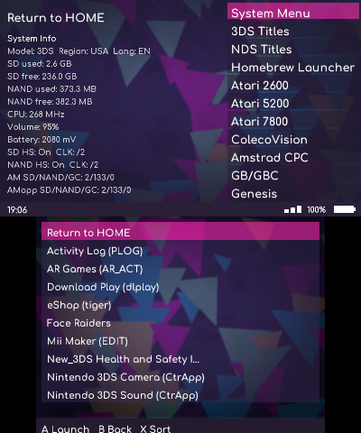
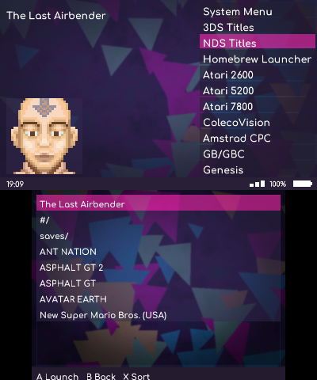

# FirmMux 3DS

FirmMux is a unified front‑end for CTR, TWL, System Menu, Homebrew, and RetroArch‑backed systems: Atari 2600, Atari 5200, Atari 7800, ColecoVision, Amstrad CPC, Game Boy/Color, Genesis/Mega Drive, Game Gear, Intellivision, Sord M5, NES, Neo Geo Pocket/Color, PokeMini, SG‑1000, Master System, SNES, TurboGrafx‑16/PC Engine, WonderSwan/Color.




## Build (Linux / WSL / MSYS2)

```
sudo dkp-pacman -Syu
sudo dkp-pacman -S devkitARM libctru citro2d citro3d 3ds-dev
make
```

Output: `FirmMux.3dsx`

## Run

Copy `FirmMux.3dsx` to `sd:/3ds/` and launch via hbmenu.

## Documentation

See the `docs/` folder for setup and backend details:
https://github.com/nextcode4u/FirmMux/tree/main/docs

- `docs/SD Layout.md`
- `docs/RetroArch Emulators.md`
- `docs/NDS Options.md`

Widescreen notes and options:
https://wiki.ds-homebrew.com/ds-index/rtcom?tab=forwarders

Per‑ROM RetroArch options (press **Y** on a ROM in emulator tabs) are stored in `sd:/3ds/emulators/rom_options.json`.

## Known Issue

- NDS cheats are currently work in progress. Cheat selection UI and usrcheat flag writes are implemented, but in-game cheat activation is not yet reliable across all titles.
