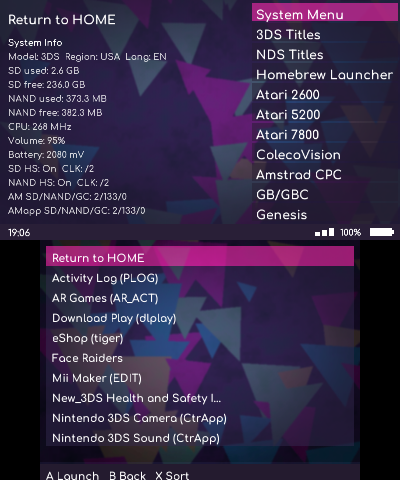
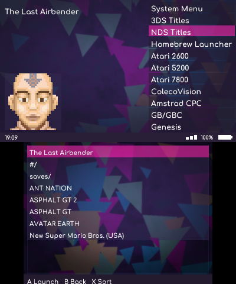

# FirmMux 3DS

FirmMux is a unified front‑end for CTR, TWL, System Menu, Homebrew, and RetroArch‑backed systems including: Atari 2600/5200/7800, ColecoVision, Amstrad CPC, GB/GBC, GBA, Genesis, Game Gear, Intellivision, Sord M5, NES, Neo Geo Pocket, PokeMini, SG‑1000, Master System, SNES, TurboGrafx‑16, WonderSwan, Arcade/CPS1/CPS2/CPS3, Neo Geo/Neo Geo CD, C64/C128/VIC‑20/Plus4/PET, PSX, Virtual Boy, Lynx, Jaguar, DOS, PC‑98, ScummVM, Quake, Uzebox, TIC‑80, WASM‑4, and LowRes NX.




## Quick Install (Recommended)

Use the PC setup script for easiest full install/update:

```bash
python3 tools/firmmux_setup_pc.py
```

Windows users (Windows-only) can double-click:

- `tools/FirmMux_Setup.bat`

`FirmMux_Setup.bat` downloads the latest `firmmux_setup_pc.py` from GitHub and runs it.

The script will:

- Prompt for SD card path
- Let you choose install/update mode
- Download latest `FirmMux-SD.zip` from releases
- Stage dependencies (RetroArch data, NTR Forwarder, CIAs)
- Show DSP firmware reminder (`sd:/3ds/dspfirm.cdc`)

## Build From Source (Linux / WSL / MSYS2)

```
sudo dkp-pacman -Syu
sudo dkp-pacman -S devkitARM libctru citro2d citro3d 3ds-dev
make
```

Output: `FirmMux.3dsx`

## Run

Copy `FirmMux.3dsx` to `sd:/3ds/` and launch via hbmenu.

On first launch, FirmMux runs a setup health check and writes:

- `sd:/3ds/FirmMux/logs/health_check.txt`

If dependencies are missing, FirmMux shows a setup status message.
Run the PC setup script:

- `python3 tools/firmmux_setup_pc.py`
- Or: `python3 tools/firmmux_setup_pc.py --sd-root <SD_ROOT>`

Health check also verifies:

- `sd:/3ds/dspfirm.cdc` (if missing, dump DSP firmware from Rosalina menu)

## Documentation

See the `docs/` folder for setup and backend details:
https://github.com/nextcode4u/FirmMux/tree/main/docs

- `docs/SD Layout.md`
- `docs/RetroArch Emulators.md`
- `docs/NDS Options.md`
- `docs/PC Setup.md`
- `docs/Themes.md`
- `docs/ROM Organizer (PowerShell).md`
- `docs/Cover Art Sync.md`

State persistence uses atomic writes with deferred idle saves to avoid launch-time stalls.

Widescreen notes and options:
https://wiki.ds-homebrew.com/ds-index/rtcom?tab=forwarders

## NDS Dependencies

- NTR Forwarder releases (required baseline for FirmMux NDS flow / nds-bootstrap forwarder setup):
  https://github.com/RocketRobz/NTR_Forwarder/releases
- NTR Launcher releases (only the `.cia` is needed from the release package):
  https://github.com/ApacheThunder/NTR_Launcher/releases
- YANBF releases (install `bootstrap.cia`; `firmux-bootstrap-prep` relies on this for handoff):
  https://github.com/YANBForwarder/YANBF/releases

Per‑ROM RetroArch options (press **Y** on a ROM in emulator tabs) are stored in `sd:/3ds/emulators/rom_options.json`.

## Known Issue

- NDS cheats are currently work in progress. Cheat selection UI and usrcheat flag writes are implemented, but in-game cheat activation is not yet reliable across all titles.

## Background Music (Optional)

- Place a looping WAV at `sd:/3ds/FirmMux/bgm/bgm.wav`.
- BGM runs on a dedicated audio channel and does not replace UI sounds.
